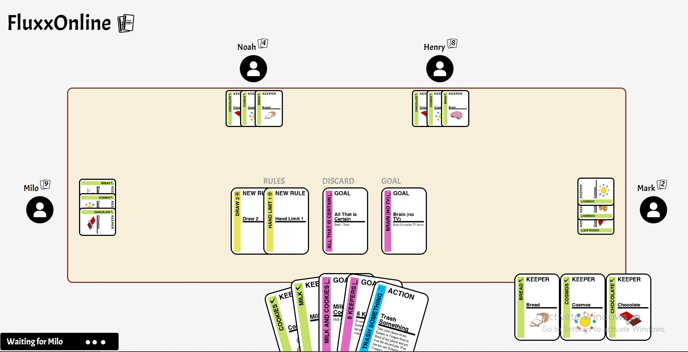

## Fluxx Online

FluxxOnline is a port of a digital version of the board game/card game Fluxx originally written in python. FluxxOnline is written in plain HTML, CSS, and JS, and hosted on a node server, with logic and validation taking place on the backend.

To start the dev server run: 
```
node index.js
```

## Board setup
